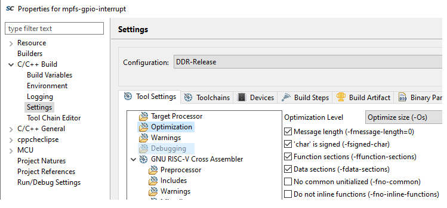
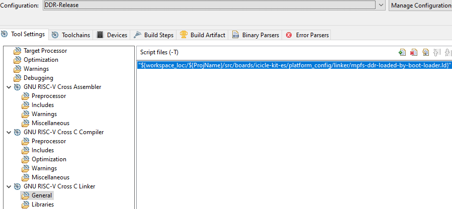
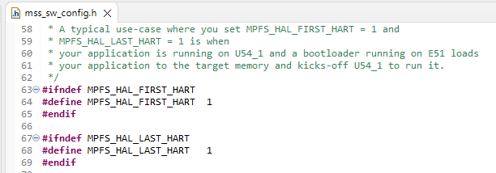
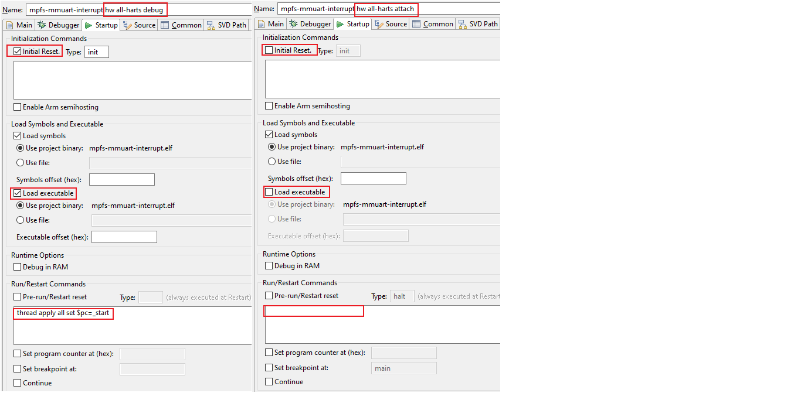

# PolarFire SoC Bare Metal Examples
This repository provides bare metal embedded software example projects with Microchip's SoftConsole IDE.

  - [Repo organization](#Repo-organization)
  - [Build configurations](#Build-configurations)
  - [Debug launchers](#Debug-launchers)
  - [Target hardware](#Target-hardware)
  - [Updating example projects](#Updating-example-projects)
  - [References](#References)

<a name="Repo-organization"></a>
## Repo organization

```
<repo>
  |-- applications
  |       |- .
  |       |- .
  |
  |
  |-- driver-examples
  |       |- mpfs-hal
  |       |- mss-can
  |       |- mss-ethernet-mac
  |       |     .
  |       |     .
  |       |     .
  |       |- mss-mmc
  |       |- mss-watchdog

```

The *applications* directory contains applications that are ready for use with the PolarFire&reg SoC Icicle kit.

The *driver-examples* directory contains example projects demonstrating the PolarFire SoC Microprocessor Sub-System (MSS) peripheral device drivers. These examples serve as an easy starting point for the users to start exploring PolarFire SoC.

Each project provides a README.md explaining its functionality and usage instructions.
All projects provide a set of ready to use build configurations and debug launch configurations. These are detailed in the following sections.

<a name="Build-configurations"></a>
## Build configurations
The build configurations configure the projects to build in a specific way. For example, Optimization level -Os, linking to DDR memory address space etc..
Below is the list of all the build configurations provided by default with each project. You may use these build configurations or create your own to suit your project.

|Configuration              | Description                                                                                                |
|------------------------- | ---------------------------------------------------------------------------------------------------------- |
|LIM-Debug                  | Download to and debug from LIM memory. Not-optimized (-O0). (Could be used with boot mode0)                 |
|LIM-Release                | Download to and debug from LIM memory. Optimized (-Os). (Could be used with boot mode 2)                   |
|DDR-Release                | Execute from cached DDR memory – typically via a bootloader. Optimized (-Os).                              |
|eNVM-Scratchpad-Release    | Booting from eNVM, program relocates itself to scratchpad memory and continues execution. Optimized (-Os). (Could be used with boot mode 1)|

A build configuration is a particular combination of SoftConsole project settings.

The following sections describe the configurations provided by the default build configurations.

### SoftConsole project settings
Some of the important project settings are explained in following sections.

#### Debug build configurations
The build configurations post-fixed with '-Debug' are intended for the early development and debug phase of the project. By convention, the *-Debug configurations use optimization level -O0 and generate maximum debug symbol information.

#### Release build configurations
The build configurations post-fixed with '-Release' are intended for the final production release, where an executable stored in non-volatile memory runs after power-on-reset, or the executable is launched by a previous stage bootloader. By convention, the *-Release configurations use optimization level (-Os) and do not generate debug symbol information. It also defines a NDEBUG macro which is used to exclude any debug code from the build.

 

**Linker scripts:** Each build configuration needs a linker script. The linker script describes the memory layout of the executable. Each build configuration selects an appropriate linker scripts via project settings. For example, eNVM-Scratchpad-Release uses mpfs-envm-lma-scratchpad-vma.ld.



There are several other settings that are required for a project. For complete project settings go to \<proect-name>->Properties->settings->Tool settings.

### Settings via header files
Apart from the SoftConsole project settings, each project needs a few more configurations. These configurations are categorized into hardware and software configurations.

#### Hardware configurations
The hardware configurations are located in the \<project-root>/src/boards/\<target-board> folder. The include files in the \<project-root>/src/boards/\<target-board>/fpga_design_config folder define the hardware configurations such as clocks. You must make sure that the configurations in this example project match the actual configurations of the Libero&reg; design that you are using to test this example project. The design configuration data generated from your libero design must be placed under the \<project-root>/src/boards/\<target-board>/fpga_design/design_description folder.

To choose a particular hardware configuration, include an appropriate \<project-root>/src/boards/\<target-board> folder path via the SoftConsole project settings.


#### Software configurations
The default software configurations are stored under the \<project-root>/platform/platform_config_reference folder. If you need to change the default software configurations, you are advised to create a new folder to replicate this folder under the \<project-root>/src/boards/ directory and do the modifications there. It would look like \<project-root>/src/boards/\<target-board>/platform_config

The include files in the "platform_config" folder define the software configurations such as the number of harts being used in the software, the tick rate of the internal timer of each hart etc.. These configurations have no dependency on the hardware configurations in "fpga_design_config" folder. Note that changing these software configurations may require a change in your application code.

To choose a particular software configuration, include either the platform_config_reference or the project specific \<project-root>/src/boards/\<target-board>/platform_config path via the SoftConsole project settings.


*MPFS_HAL_FIRST_HART and MPFS_HAL_LAST_HART:*

Select the number of harts your application wants to use. Typical usecase is when you are developing the software to run from eNVM as bootloader which copies application executable to the DDR memory and wakes-up U54_1 to execute that application 
In this case you choose MPFS_HAL_FIRST_HART = 0 and MPFS_HAL_LAST_HART = 1.



*IMAGE_LOADED_BY_BOOTLOADER:*

One of the important software configurations is to configure IMAGE_LOADED_BY_BOOTLOADER in the mss_sw_config.h. We set IMAGE_LOADED_BY_BOOTLOADER = 0 when no previous stage bootloader is used. For example, when an application stored in non-volatile memory starts running after reset. The default software configuration uses this setting.

Set IMAGE_LOADED_BY_BOOTLOADER = 1 when you want the application's executable image to be loaded by a previous stage bootloader. The DDR-Release is one such configuration which uses this setting. The modified mss_sw_config.h can be found  under the \<project-root>/src/boards/\<icicle-kit-es>/platform_config folder.


<a name="Debug-launchers"></a>
## Debug launchers
The following two pre-configured debug launchers are provided with each project.

|Configuration              | Description                                                                                                |
|---------------------------|------------------------------------------------------------------------------------------------------------|
|_\<project name> hw all-harts debug.launch_ | Intended to be used with *-Debug configurations. Resets harts.<br> Downloads the executable and the symbols to the memory. Sets up PC to start location. |
|_\<project name> hw all-harts attach.launch_ | Intended to be used with *-Release configurations. Does not reset harts. <br> Downloads only the symbol information and attaches to harts. Typically used to check the current state of harts. If the project is linked to RAM memory such as DDR, you will be able to put breakpoints and step debug further.                   |



Both launchers are configured to use the currently _active_ build configuration, hence the same launcher can be used with any of the build configurations. Make sure that an appropriate build configuration is set as _active_ to avoid issues. Trying to use _all-harts attach.launch_ while a *-Debug build is _active_ may not work.

You may change the existing debug launchers or create your own launcher to suit your project.

<a name="Target-hardware"></a>
## Target hardware
All of the projects are tested on the PolarFire SoC Icicle kit. All the projects are tested with the latest available Icicle kit [Reference Libero design](https://mi-v-ecosystem.github.io/redirects/repo-icicle-kit-reference-design) or one of it's variants, unless noted otherwise. Please refer README.md in each project for details.

<a name="Updating-example-projects"></a>
## Updating example projects
Some of the example projects under in this repository may not contain all or latest versions of all the drivers. In such cases, please download the _platform_ repository and replace the src/platform repository in the example project with it.
When you update the _platform_ repository in your project, you must make sure that the reference design (and the xml configuration) is compatible with it.

<a name="References"></a>
## References
For the latest releases of the MPFS HAL, peripheral device drivers and default reference platform configurations refer [PolarFire SoC platform](https://mi-v-ecosystem.github.io/redirects/repo-platform).

For more details on the SoftConsole Bare metal software project folder structure refer to the [Bare Metal Software Projects Structure](https://mi-v-ecosystem.github.io/redirects/bare-metal-project-structure_bare-metal-software-project-structure).

For more information on boot modes [PolarFire SoC Boot Modes](https://mi-v-ecosystem.github.io/redirects/boot-modes_boot-modes-fundamentals).

___
Libero&reg; and PolarFire&reg; are the property of Microchip Technology Inc. (MCHP).
